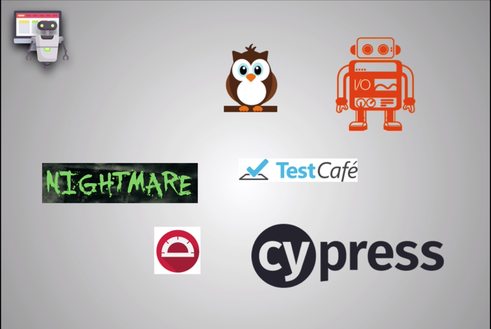
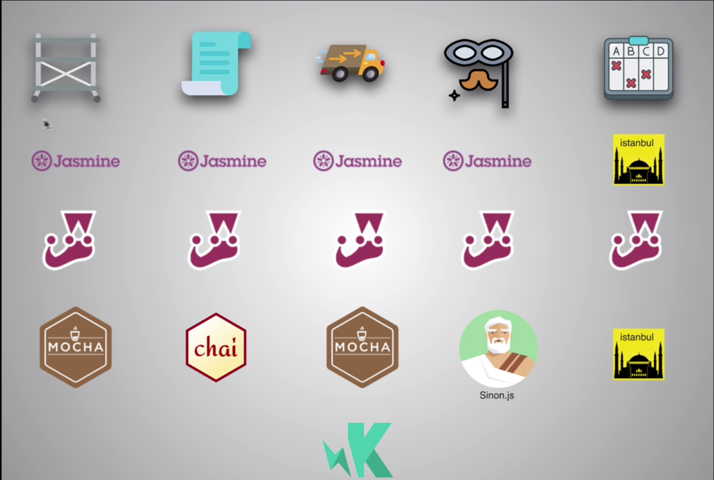
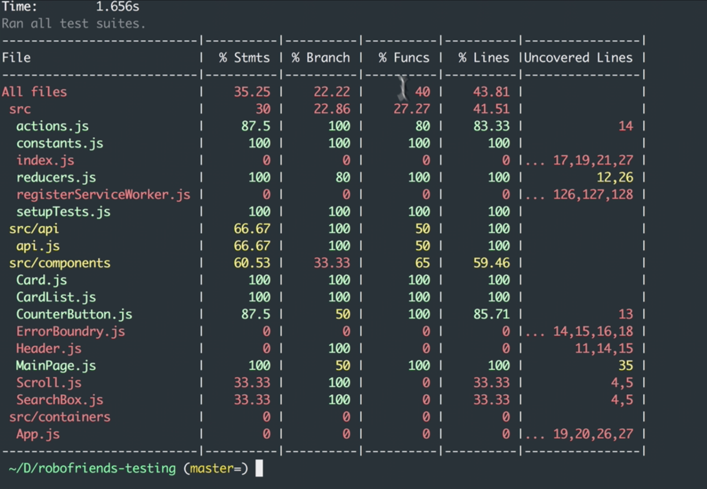
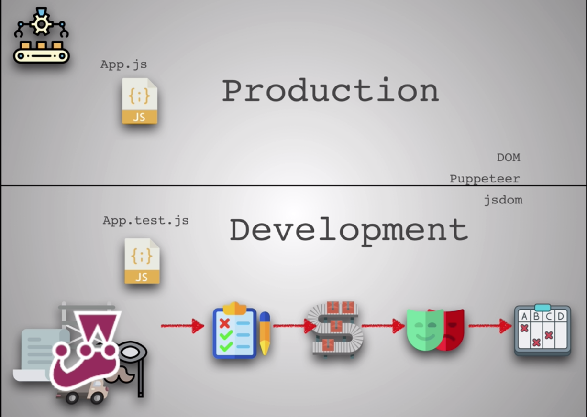
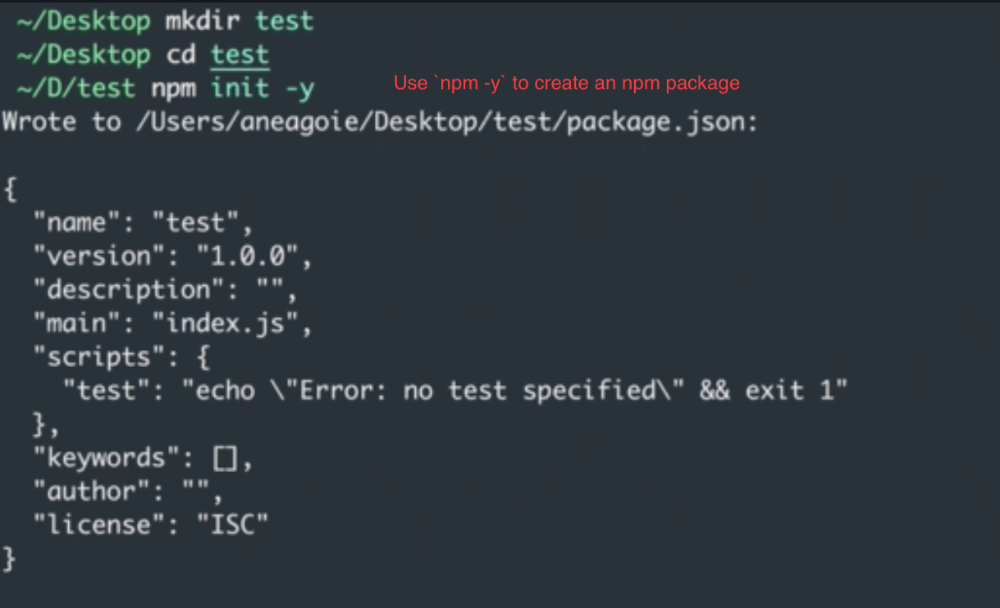

# Testing

## Testing Overview

* **Testing** is a method in software development where individual units of source code, assets or programs are tested to see whether they work properly.
* A **test** is simply another file in your project.
  * This file never runs in production or on a product website. Instead it runs in development.
* It's a file that you run to make sure everything works before you release it to production. That way you just have code written that works as intended.
* **TDD** or **Test Driven Development** is the idea of writing tests even before you actually write your application code so that you start writing code based on the tests that you provide.

## Unit Tests

* Should cover all small, **pure functions** of an application.
  * Small, **pure functions** take an input and return an output. They do one thing at a time really really well.
  * It's the main principle in **functional programming**.
* They test individual functions or classes.
* They are the cheapest to implement, the easiest to implement and 90 percent of your time you're going to be working on writing unit tests.
* The awesome side effect of this is that it allows us to write unit tests really easily because our functions are so simple.
  * Just give it an input and get an output and just test that based on an input.
  * This is one of the biggest benefits of **functional programming** versus **object oriented programming**.
* A **pure function** is a function that has no side effects, like affecting another part of a program and always return something based on an input.
  * It is deterministic, meaning that you can put in the same input and you'll still get the same output the exact same way which makes testing very easy.
* **React** components are mostly pure functions.
  * **Stateless components** that don't have any life cycles or states get an input, which are props and they return an output which is the view.
* **Unit tests** don't test the **contract**.
  * The **contract** is the connection between things.
    * It could be a contract between a server and a database.
    * It could be a contract between a function and another function.
    * Maybe my sign in function calls a load profile function. **Unit tests** would test the sign and function and a load function but not the contract between them.
* **Unit tests** write code that is separated away nicely.
  * Clean, functional components are functions which make it easier to use unit tests because everything comes in small chunks.
  * This is going to lead to nice maintainable code in the long run.
* With **Unit tests**, you would probably use something like **Spies** from a mocking library to ensure expected side effects instead of just asserting an output.
* You might also use **Stubs** to mock and modify parts of a process that are not inside of the specific test such as mocking a database call.

## Integration Tests

* **Integration tests** are all about cross communication between different units of code.
* Testing how different pieces of code work together.
* It can be testing whether the database works with, for example, the Express App that's requesting some data from the database, or it could be testing how a function works with another function and how this connection between them, functions.
* A fake user, just for the test as opposed to unit testing a browser or a browser like environment, could help with the processes that are dependent on the window object.
  * This is especially true when we're working with **React** and rendering components.
* Think of **Integration Tests** as connecting components to see how they work together instead of individual small units that unit tests test.
* The downside to them is that they're expensive.
  * They're slower.
  * There's more dev time involved in thinking them out and writing them compared to unit tests which are much faster.
  * They also have a lot of moving parts.
  * If you change something, your test will break and you'll have to change those tests that depend on that thing you changed.
* **Integration tests** can be brittle really fragile sometimes and they are much much harder to read.
* Unlike unit tests, you can write an infinite amount of integration tests.
  * It's hard to say when you're done writing them or when you have a 100 percent completion because it's impossible to cover everything and every test case.
* Since they're also more expensive it's rare to see a company that has really good integration tests unless they're a massive company with a strong engineering team and a ton of money to spend on that engineering team.

## Automation Tests

* Sometimes called **End-to-End tests** or **UI tests**, are always running inside a browser or a browser like environment because they try to simulate user behavior in these environments such as clicking, typing, scrolling...
* They usually involve testing real life scenarios on the browser by controlling the browser and making
sure that the expected behavior on the web is correct.
* You can have humans doing this where they go through and click through everything on your Web site and make sure everything works, or you can programmatically have robots or code that you write that runs through these tests for you.
* As we go down into this order, (Unit Tests, Integration Tests, Automation Tests), they become more and more expensive to implement.
* They need to make sure that these scenarios actually work from the point of view of an end
user.
* It's important to remember that **Automation tests tests** are the hardest to set up.
  * This is why there are so many services that provide automation testing for you.
   
  * *Nightwatch, Web Driver I/O, Nightmare, Test Cafe, Cypress...*
* **Automation testing** is something you usually only find at bigger companies that have the budget to really spend money on them because there are so many cases and they're so expensive
to implement.
  * Some developers go their whole career without ever writing an automation test.
* If you just want to get started and not worry about cross browser and have all the tools in one probably **Test Cafe´** is the best choice.
* If you want the one that has the best documentation online, **Web Driver IO** is really great.
* If you want really simple ways to automate user actions or do something like web scraping,      **Nightmare.js** is pretty good.
* Many companies instead of writing these scripts simply hire people to do automation testing and at some companies you have people like testers that do this for you and make sure that the app works as intended.
* The main thing is that we want to create two different testing processes.
  1. One for running unit tests and integration tests
  2. A completely separate one to run these UI tests. The automation tests.
     * That's because UI tests take a longer time especially if we worry about different browsers and different devices and they also cost a lot more money to run them repeatedly.
* So you'd want to run **Unit tests** and **Integration tests** often, probably in your terminal as you're saving your changes to your code in your local environment.
* Run **UI tests** once a day or a couple of times a week or maybe just before you merge into the master branch before you release it to production.

## Testing Libraries

* The scaffolding giving us the ability to use some function calls and some new methods for us to actually write our tests.
  * Think of this as scaffolding or building this structure around our tests.
* The top three libraries for testing is **Jasmine**, **Jest** and **Mocha**.
* These are just **NPM** installed libraries so they're available on **NPM** and you can add them to build your scaffolding.

### Assertion Libraries

* **Jasmine** and **Jest** are examples that come with their own assertion library.
* **Chai** usually gets paired with **Mocha** in order to have an assertion library.
* An assertion library provides functions that are assertion functions.
  * It's essentially a tool to allow you to test that the variables contain the expected value.
* **Chai** uses **BDD** or behavioral driven development. **[Chai Assertion Library](https://www.chaijs.com/api/bdd)**

### Test Runner

* A **test runner** is a program that allows us to run our tests `npm run test`.
* **Jasmine**, **Jest**, **Mocha** and **Karma** all have their own test runners.
* **Karma** allows you to run tests in the browser.
* a **test runner** can run tests in different environments.
* Running our tests in the browser can be inefficient because it takes a lot of time.
  * We have to run every single test through the browser using the browser API.
* Other options exist such as **Puppeteer** by **Google** which is what we call a **headless browser**.
  * It's a node library which provides a high level API to control the headless version of their browser.
  * Think of it as a stripped down browser that makes your tests a little bit faster.
  * It can also be configured to do things such as generate screenshots PDSA of pages.
  * It can automate form submissions.
  * You can do UI testing with it.
  * You can monitor keyboard input.
* **jsdom** is a JavaScript implementation of the **DOM**.
  * It's not the real **DOM** but a pseudo javascript version of it.
  * We can have a **DOM**-like API that works without actually needing the browser.

### Mocks

* **Jasmine**, **Jest** and **Sinon.js** all use them.
* Is kind of like faking a function or a behavior to test different parts of a process.
  * So this might be really really good for integration tests.
  * **[Sinon JS](https://sinonjs.org/)**

### Spies

* Provide information about functions.
  * How many times they were called in what cases and by who.

### Stubs

* **Stubbing** replaces selected functions with a function to ensure that the expected behavior happens.
* **[Sinon JS](https://sinonjs.org/)** can be used to fake a server during our tests.

### Code Coverage

* **Code Coverage** is provided by libraries like **Istanbul**.
  * **Jest** has code coverage already included but actually has **Istanbul** running underneath the hood.
  * Commands for testing coverage `npm test --coverage`
   

## Popularity

* **Jest** has overtaken **Jasmine** as the most popular because it has all of the components of the testing tools built in.
* **Mocha** combined with **Chai** and **Sinon.js** also very popular and used frequently.
* Most of these libraries follow the idea of **behavioral driven development** which is, we describe what a function does and what behavior we expect out of them.
* Luckily if it wasn't for **createReact** app we'd have to **NPM** install all of the dependencies manually, set them up and add them to our **NPM** scripts to run all these tests and test coverages.
  * With **createReact** app up we have everything configured right out of the box.
  * **Jest** tools that are used in **createReact**.
    * **Enzyme** created by **Air BnB** and helps us write tests better for **React** components.
    * **Snapshot testing**
    * these are implemented on most **React** projects that are encountered and are pretty much become the standard in the **React** ecosystem to use these libraries.
* If you just want to get started and are looking for a fast framework that can handle everything and has everything in one, use **Jest**.
* If you want a very flexible extendable configuration where you can plug in some things then use **Mocha**.
  * **Mocha** is a little harder to set up because of all the things that we need to add on but it's more flexible and open to extensions.

### Other Testing Libraries

* **Ava**, which  does parallelism really well. (it can run tests  really fast.)
* **Tape** is a really low-level, simple, light library.

## Production and Development tools

## Tests in development

* Keep in mind that tests are meant for development. You're never going to ship your test libraries or your test code into production.
* Most of the time, you're saving these libraries with the `--save-dev` or `npm install --save-dev jest` in **NPM** because they're
only used for development.
* In **development** as you're writing your tests and as you're writing your code, you have something like **Jest** running in the background that has the **scaffolding**, the **assertion library**, the **Test Runner**, the **Spies**, **Mocks** and  **Stubs** that we need to read the tests, run the tests, see which tests pass or fail and also add **Code Coverage** so that we can work on our project and when it's ready, it passes all the tests, it has all the tests we need. We can then send it to production without all this stuff that production doesn't need.
* Remember that when we're running these tests,
we can run them in the **DOM**, we can run them in a **headless browser**, or we can just run them on the **desktop**.

* We're going to use **Jest** because it's the fastest and the simplest way to run our tests with **createReact**.

## Creating an **NPM** package with `npm-y`

